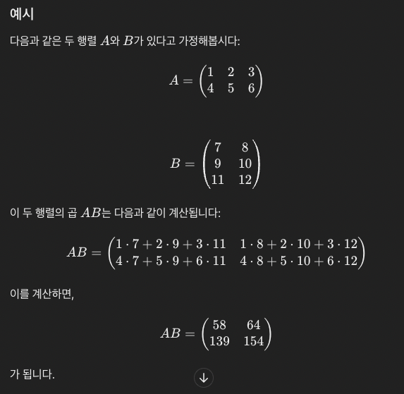
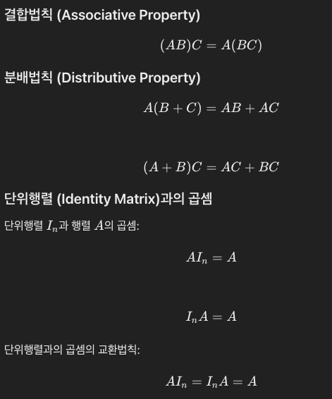
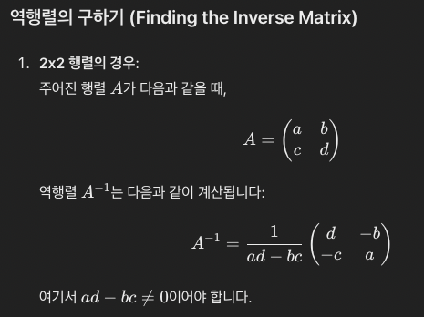
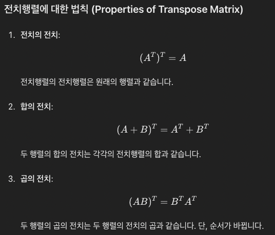
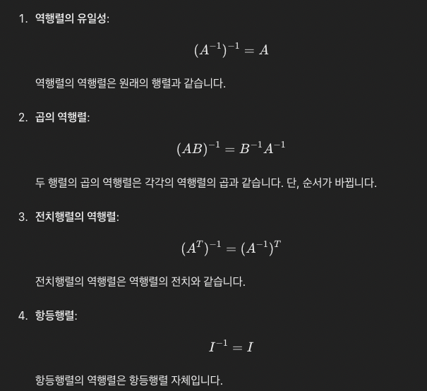

# 02. 선형대수

벡터의 특징
- 벡터를 서로 더해서 나오는 결과는 벡터
- 벡터에 스칼라를 곱해서 나오는 결과는 벡터

 

선형대수의 알고리즘은 대부분 실수 벡터 공간에서 식이 만들어짐

## 2.1 연립선형 방정식(Systems of Linear Equation)
- 연립선형 방정식에서 나올 수 있는 경우는 3가지
1. 해가 없음
2. 정확히 1개
3. 무수히 많음

 

variable이 3가지 이상인 경우에도 위와 같은 경우가 나옴  
연립 방정식을 풀기 위해, 시스템적인 접근은 행렬을 사용
- programming language로 행렬을 list or array로 표현할 수 있기 때문

 

## 2.2 행렬(Matrix)
> 행렬(Matrix)은 숫자나 문자의 직사각형 배열로, 특정 규칙에 따라 행과 열에 배치된 데이터를 나타낸다.
> 일반적으로 행렬은 대문자 알파벳으로 표기되며, 행렬의 원소는 소문자 알파벳으로 표기한다.

 

행방향으로 있는 행렬을 row vector, 열방향으로 있는 행렬을 column vector
- row vector: 1 x n 행렬
- column vector: m x 1 행렬

 

### 2.2.1 행렬의 덧셈과 곱셈
**덧셈**
- 각 행렬의 요소끼리 더한다.
- 행렬의 덧셈 결과는 행렬

**곱셈**
- 왼쪽 피연산의 행렬의 column 수와 오른쪽 피연산자의 행렬의 row 수와 일치해야 곱셈을 할 수 있음
- neighboring dimension이 일치해야함
- AB의 결과와 BA의 결과가 다를 수 있음. i.e. 교환법칙(commutative)이 성림하지 않음
 

### 예시

 

**단위 행렬(Identity Matrix)**
- 대각선에 있는 요소의 값이 1이고 나머지가 0인 행렬

 

 

**역행렬(Inverse Matrix)**
- A와 B가 n x n의 실수 공간 행렬에서 정의될 때, AB = I = BA이면 B를 A의 역행렬이라고 한다.
- 역행렬은 항상 존재하는 것이 아님. 역행렬을 갖지 않는 행렬을 특이행렬(Singular Matrix)라고함
- 역행렬을 갖는 행렬은 unique함

 

 

핵심은 `ad-bc`의 결과가 0이 나오면 안됨. 이 식을 `determinant`라고 부른다.

 

**전치 행렬(Transpose Matrix)**
행렬 A, B가 각각 m x n 실수 차원 공간과 n x m 실수 차원 공간에서 정의되고, a(j, i) = b(i, j)일 떄 B를 A의 `transpose`라고 부른다.

 

**전치 행렬과 역행렬의 중요 성질**

 

 

### 2.2.3 스칼라와 행렬의 곱
결합법칙, 분배법칙, 교환법칙 모두 성립

## 2.3 연립 선형 방정식 풀이
알고리즘 관점에서, Ax=b를 풀 때, A의 역행렬을 곱해서 풀 수 있으나, A의 역행렬이 존재하지 않는다는 것을 우리는 알아야한다.
따라서 좀 더, 마일드한 가정으로 만약 각 column들이 서로 선형 독립적이라면, 전치행렬과 역행렬을 이용해서 문제를 해결한다.
- 문제는 연산이 너무 많음

대안으로 가우시안 소거법 사용
- determinant
- 벡터의 집합이 선형 독립적인지
- 역행렬 계산

 

하지만 이것도 구해야할 변수의 개수가 너무 많아지만 무용지물  
다른 방법을 쓴다..

 

## 2.4 벡터 공간

아벨군(Abelian group) 성립 조건
- 결합법칙
- 항등원 존재
- 역원 존재
- 교환법칙

벡터 공간은 덧셈에 대하여, 아벨 군을 형성

 

GL(General Linear group)
- 역행렬이 존재
- 결합 법칙
- 항등원 존재
- 비 아벨군 i.e. 교환 법칙 성림하지 않음

 

벡터의 subspace
- 벡터의 하위 공간에서 벡터 연산을 할 수 있고, 그 연산의 결과는 그 공간을 벗어나지 않음
- ML에서 매우 중요한 개념
- subspace인 걸 알고 싶다면, outer operation, inner operation 모두 닫혀있어야함

 

## 2.5 선형 독립

선형 조합(linear combination)
- 벡터들을 scaling 후, 모두 더한 결과는 벡터

 

선형 독립(linear independence)
- 한 벡터의 결과가 다른 벡터들의 선형 조합으로 나오지 않음

 

## 2.6 기저, 랭크

생성 집합(generating set)
- 벡터 공간에 존재하는 벡터를 그 집합의 벡터들의 선형 조합으로 표현 할 수 있는 벡터들의 지밥

기저(basis)
- 특별한 종류의 생성 집합. 벡터 공간은 모두 벡터를 표현 할 수 있을 뿐만 아니라, 그 집합의 벡터들이 선형 독립인 경우

 

## 2.6.2 랭크(rank)
- 행렬에서 선형 독립인 행 또는 열의 최대 개수
- 행렬 A가 Ax = b의 계수 행렬일 때, A의 랭크를 사용해서 해의 존재여부와 유일성 결정 할 수 있음
- 차원 분석: 선형 변환의 랭크는 변환 후의 공간 차원을 제공하므로, 이를 통해 데이터 압축, 차원 축소등을 분석
- 독립성, 종속성

 

## 2.7 선형 사상(Linear mapping)
- 벡터를 사상시켜도 벡터의 성질을 유지

## 2.8 아핀 공간(affine space)
- 원점이 명시적으로 정의되지 않은 공간 -> 점, 벡터 사이의 관계를 탐구 할 수 있음
- 점과 벡터의 덧셈 결과는 점을 생성 -> 연산의 결과는 점에서 벡터만큼 이동한 위치를 의미
- 점과 점의 뺼셈 결과는 벡터를 반환 -> 한 점에서 다른 점으로 이동한 방형과 거리
- 아핀 공간은 방향을 갖지만 절대 위치를 갖지 않음 -> 공간 내 이동에 의해, 구조가 변하지 않음을 의미

