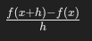
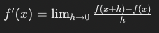
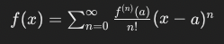
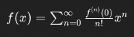
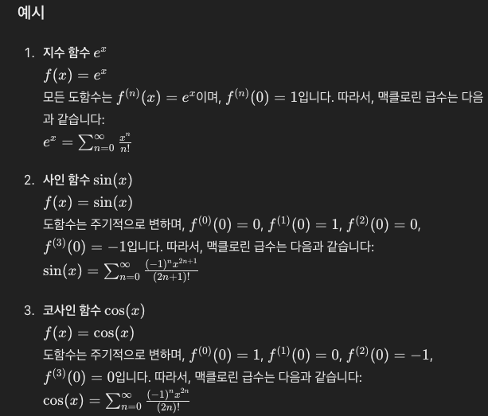
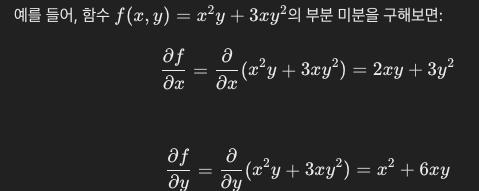
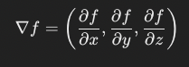

# 05. 벡터 미적분학

## 5.1 단변수 함수(univariate function)의 미분

**차분 몫(difference quotient)**

 

h가 0에 가까워질 떄의, 함수의 변화율을 나타내며 이 과정에서 도함수 정의
- difference quotient는 함수의 순간 변화율 -> 미분계수에 근사

 

위의 결과로 도함수를 정의할 수 있으며 식은 다음과 같음

 

### 5.1.1 테일러 급수(Taylor series)

- 테일러 급수는 함수 `f(x)`를 무한급수 형태로 표현, 주어진 점 `a`에서 함수의 값과 그 점에서의 도합수 값을 이용해 표현
- 결과적으로 복잡한 함수를 다항식으로 풀어낼 수 있음

 

 

**맥클로린 급수(Maclaurin series)**
- 테일러 급수의 중심이 0인경우를 맥클로린 급수라고함

 

 

예제)

 

 

## 5.2 부분 미분(partial differentiation), 기울기(gradients)

**부분 미분**

- 다변수 함수에서 하나의 변수에 대해 미분을 수행. 이 떄, 나머지 변수들은 상수 취급

 

 

**기울기**
- 다변수 함수의 모든 부분 미분을 벡터 형태로 표현.

- 함수의 변화율이 가장 큰 방향을 나타내는 곳. 해당 방향에서의 변화율 크기를 벡터의 크기로 표현

